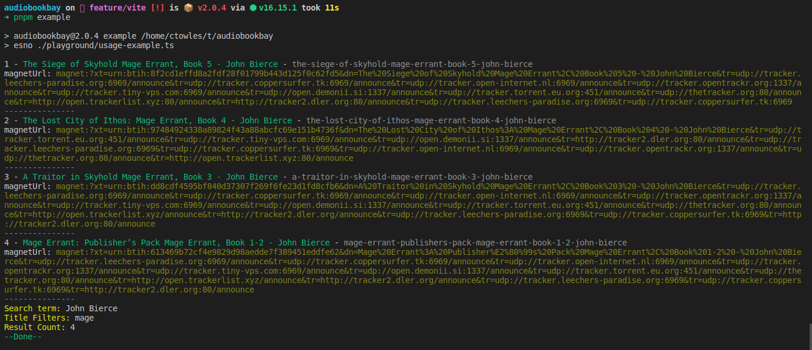

<p align="center">
    
</p>
<h1 align="center">
AudioBookBay Scraper JavaScript
</h1>

## 🏁 Install

```shh
npm install audiobookbay
```

## 🔍 Search Audiobooks

| Name      | Description            | Default                                               | Type   |
| --------- | ---------------------- | ----------------------------------------------------- | ------ |
| Query     | Search Query           |                                                       | String |
| Page      | Search Page            | 1                                                     | Number |
| Search In | Text content to search | `{ titleAuthor: true, content: true, torrent: true }` | Object |

<br>

```js
import { search } from "audiobookbay";

const audiobooks = await search("dune", 1, {
  titleAuthor: true,
});
```

### Response

```json
{
 "pagination": {
  "currentPage": "Current Page",
  "total": "Total Pages"
 },
 "data": [
   {
     "title": "Audiobook Title",
     "url":
       "Audiobook URL",
     "category":
       ["Array of Categories"],
     "lang": "Audiobook Language",
     "cover": "Audiobook Cover",
     "posted": "Date when Audiobook was posted",
     "info": {
         "format": "Audiobook Format",
         "bitrate": "Audiobook Bitrate",
         "size": ["Audiobook Size","Size UNIT"]
     }
   }, ...
 ]
}
```

### 🪣 Explore By Category/Tag

#### Category Options

<ul>
  <li>
    Age: children, teen-young-adult, adults, the-undead
  </li>

  <li>
    Category: postapocalyptic, action, adventure, art, autobiography-biographies, business, computer, contemporary, crime, detective, doctor-who-sci-fi, education, fantasy, general-fiction, historical-fiction, history, horror, lecture, lgbt, literature, litrpg, general-non-fiction, mystery, paranormal, plays-theater, poetry, political, radio-productions, romance, sci-fi, science, self-help, spiritual, sports, suspense, thriller, true-crime, tutorial, westerns
    </ul>
  </li>

  <li>
    Category Modifiers: anthology, bestsellers, classic, documentary, full-cast, libertarian, military, novel, short-story
  </li>
</ul>

#### Tag Options

<ul>
  <li>
  Popular Language: english, dutch, french, spanish, german
  </li>
</ul>

| Name   | Description              | Default  | Type   |
| ------ | ------------------------ | -------- | ------ |
| Type   | Explore by tag, category | category | String |
| Option | Options filter           |          | String |
| Page   | Page Number              | 1        | String |

<br>

```js
import { explore } from "audiobookbay";

const audiobooks = await explore("category", "postapocalyptic", 2);
```

### Response

```json
{
 "pagination": {
  "currentPage": "Current Page",
  "total": "Total Pages"
 },
 "data": [
   {
     "title": "Audiobook Title",
     "url":
       "Audiobook URL",
     "category":
       ["Array of Categories"],
     "lang": "Audiobook Language",
     "cover": "Audiobook Cover",
     "posted": "Date when Audiobook was posted",
     "info": {
         "format": "Audiobook Format",
         "bitrate": "Audiobook Bitrate",
         "size": ["Audiobook Size","Size UNIT"]
     }
   }, ...
 ]
}
```

### 🎵 Get Audiobook

| Name | Description  | Default | Type   |
| ---- | ------------ | ------- | ------ |
| ID   | Audiobook ID |         | String |

<br>

```js
import { audiobook } from "audiobookbay";

const audiobook = await audiobook(
  "the-road-to-dune-brian-herbert-kevin-j-anderson-frank-herbert"
);
```

### Response

```json
{
  "title": "Audiobook title",
  "category": ["Array of Categories"],
  "lang": "Audiobook Language",
  "cover": "Audiobook Cover",
  "author": "Audiobook Author",
  "read": "Audiobook Reader",
  "audioSample": "Sample of Audiobook MP3",
  "specs": {
    "format": "Audiobook Format",
    "bitrate": "Audiobook Bitrate"
  },
  "abridged": "Is the book shortened",
  "desc": "Audiobook Description",
  "torrent": {
    "hash": "Audiobook Hash",
    "trackers": ["Audiobook Trackers"],
    "size": ["Audiobook size", "Size UNIT"],
    "magnetUrl": "Magnet Link" // 🧲 Magnet Link
  },
  "related": [
    {
      "title": "Related Audiobook Title",
      "url": "Related Audiobook URL"
    }
  ]
}
```

### Example Usage

Included is an example using the library.

[usage-example.ts](./playground/usage-example.ts)

To run it from this repo.

```bash
pnpm example
```


